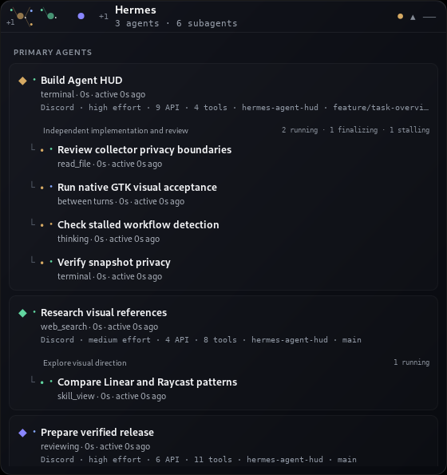
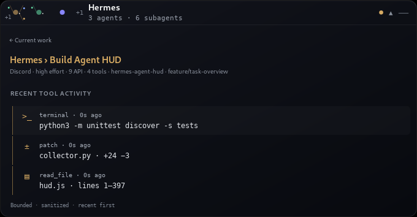

# Hermes Agent HUD

A privacy-safe, read-only live operations view for Hermes agents and subagents.

- **Hermes Desktop plugin:** native pane, full page, sidebar entry, and status-bar summary on Linux, macOS, and Windows.
- **Linux standalone:** independent always-on-top GTK overlay with AppIndicator and multi-monitor placement.





## Install as a Hermes plugin

Hermes Agent `0.20.2` or newer is recommended.

```bash
hermes plugins install nnboskovic/hermes-agent-hud --no-enable
hermes plugins enable agent-hud --no-allow-tool-override
```

Then fully quit and reopen Hermes Desktop so the read-only backend route mounts. In **Settings → Plugins**, enable **Hermes Agent HUD**.

Two explicit switches are intentional:

1. `hermes plugins enable agent-hud --no-allow-tool-override` allows the backend projection to load while explicitly denying the unrelated privileged override capability.
2. The Desktop setting enables the renderer contributions.

The plugin then contributes:

- A right-side **Agent HUD** pane.
- A full **Agent HUD** page in the sidebar.
- A status-bar count that opens the full page.
- Independent primary-agent groups with only their own subagents nested below.
- Recent structured activity for a selected agent or subagent.

### Update or remove

```bash
hermes plugins update agent-hud
hermes plugins disable agent-hud
hermes plugins remove agent-hud
```

## Install the Linux standalone overlay

The standalone overlay floats above other applications and does not require Hermes Desktop.

Requirements:

- Python 3.10+
- GJS 1.72+
- GTK 3.24
- AyatanaAppIndicator3 0.1 and a StatusNotifier/AppIndicator host
- systemd user services

```bash
git clone https://github.com/nnboskovic/hermes-agent-hud.git
cd hermes-agent-hud
python3 install.py
```

This installs runtime files under `~/.local/share/hermes-agent-hud/` and enables:

```text
hermes-agent-hud-collector.service
hermes-agent-hud.service
```

Operate it with:

```bash
systemctl --user status hermes-agent-hud-collector.service hermes-agent-hud.service

gapplication action com.hermes.AgentHud toggle
gapplication action com.hermes.AgentHud minimize
gapplication action com.hermes.AgentHud show

python3 install.py --uninstall
```

## What it shows

### Ambient view

The standalone collapsed HUD shows up to three independent primary-agent constellations, active child nodes, truthful overflow beads, aggregate counts, and the highest-severity lifecycle state.

Separate primary agents are never connected. Thin branches exist only between one primary agent and its own active children.

### Current work

The Desktop and standalone views show:

- Current primary Hermes sessions.
- Title, source, structured action, runtime, and last-activity age.
- Explicit reasoning effort and API/tool counters when Hermes records them.
- Delegated batches grouped under their authoritative parent session.
- Explicit running/finalizing/stalling/completed/failed progress.
- Neutral unmatched work rather than invented ownership.
- Recent-first sanitized commands, file activity, tool names, and diff summaries.

Model identity is intentionally omitted. The HUD never invents completion percentages or per-child call counters.

## Read-only and privacy contract

The plugin and standalone collector share the same bounded projection.

- Primary count comes from Hermes gateway state.
- Primary identity and action come from fresh, unended non-subagent sessions in read-only `state.db`.
- Delegation ownership and lifecycle come from durable `async_delegations`, manifests, and explicit confined redacted-log events.
- SQLite is opened with `mode=ro` and `PRAGMA query_only=ON`.
- Only the explicit Hermes `final | end status=...` record terminates a child ahead of a lagging manifest.
- Activity lists are recent-first and capped at 12 items.
- Primary rows are capped at 32; delegation and child collections are bounded.
- Commands, labels, identifiers, and fields are length-bounded and sanitized.
- Absolute/home paths become `[path]`; relative file activity exposes only a safe basename/range projection.
- Secret environment assignments, authorization forms, credential flags, known token prefixes, and URL/query secret values are redacted.
- Generic structured tools expose allowlisted projections or argument names, never arbitrary values.
- Delegation manifests must be bounded regular files whose opened identity matches the confined directory entry; symlinks and replacement races fail closed.
- Confined task logs reject symlinks and traversal, use no-follow handling where available, and must be exact regular `task-N.log` files.

The published projection never includes:

- Prompts or unrestricted message bodies.
- Reasoning.
- Full argument maps or arbitrary argument values.
- Raw tool results or terminal output.
- File contents.
- Full patch bodies.
- Credentials, secrets, or unrestricted paths.

The plugin registers **zero model-facing tools, zero hooks, and no mutation actions**. It does not pause, stop, restart, or redirect agents.

## Plugin architecture

```text
plugin.yaml                 Hermes install/enable metadata
__init__.py                 no-op root registration
agent_hud/collector.py      bounded read-only projection
dashboard/manifest.json     hidden backend-only dashboard companion
dashboard/plugin_api.py     GET /api/plugins/agent-hud/state
desktop/plugin.js           native Desktop pane/page/sidebar/status UI
```

The Desktop half polls its namespace every 2.5 seconds with a bounded timeout. It normalizes and re-bounds the response before rendering plain text. The backend returns a generic `503` on failure and never forwards exception details.

For a remote Hermes backend, install and enable the backend package on the remote machine as well as the Desktop package on the local machine. Local-backend use is the primary tested configuration for v1.0.0.

## Standalone behavior

- Drag the header to move the overlay.
- Position persists privately with mode `0600`.
- Drag release clamps to the monitor containing the window center, including secondary and negative-origin monitors.
- The `—` control hides the overlay into the notification-bar indicator.
- Large task lists scroll inside a bounded panel.
- Text uses an accessibility-oriented scale: 13 px titles, 11 px metadata, 10 px technical summaries, and 12 px activity detail.

## Development and verification

```bash
npm ci --ignore-scripts --no-audit --no-fund
python3 -W error::ResourceWarning -m unittest discover -s tests -p 'test_*.py' -v
node tests/test_ui_model.mjs
npm run test:desktop
gjs tests/test_css.js
node --check desktop/plugin.js
hermes plugins doctor . --ci
```

The native tests launch uniquely named GApplication instances inside Xvfb. They verify collapsed/expanded/activity geometry, real pointer dragging, private position persistence, monitor clamping, and minimize/show restoration without touching the installed HUD.

The Desktop contract test evaluates the real `desktop/plugin.js` module against a mocked `@hermes/plugin-sdk`, then recursively renders all four contributions with locked React/ReactDOM versions. It covers owned and unassigned work, requires zero renderer warnings, exercises the bounded backend request, and disposes the polling timer.

## License

MIT — see [LICENSE](LICENSE).
